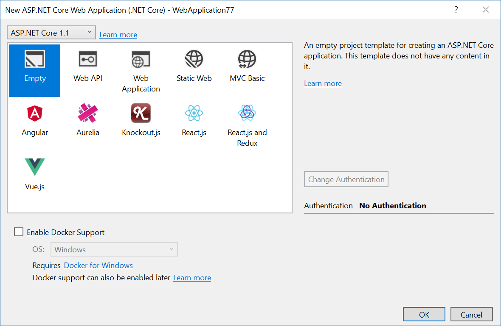

# ASP.NET Core SPA Templates

<!-- Update the VS Gallery link after you upload the VSIX-->
Download this extension from the [VS Gallery](https://visualstudiogallery.msdn.microsoft.com/[GuidFromGallery])
or get the [CI build](http://vsixgallery.com/extension/4336beed-a389-4f86-9138-40d258e78ccf/).

---------------------------------------

A template pack containing ASP.NET Core SPA templates for Angular, Aurelia, React, Knockout and Vue.js.

See the [change log](CHANGELOG.md) for changes and road map.

## Templates included

- ASP.NET Core 1.1 with Angular
- ASP.NET Core 1.1 with Aurelia
- ASP.NET Core 1.1 with Knockout
- ASP.NET Core 1.1 with React
- ASP.NET Core 1.1 with React+Redux
- ASP.NET Core 1.1 with Vue.js

## Contribute
Check out the [contribution guidelines](.github/CONTRIBUTING.md)
if you want to contribute to this project.

For cloning and building this project yourself, make sure
to install the
[Extensibility Tools 2015](https://visualstudiogallery.msdn.microsoft.com/ab39a092-1343-46e2-b0f1-6a3f91155aa6)
extension for Visual Studio which enables some features
used by this project.

## License
[Apache 2.0](LICENSE)